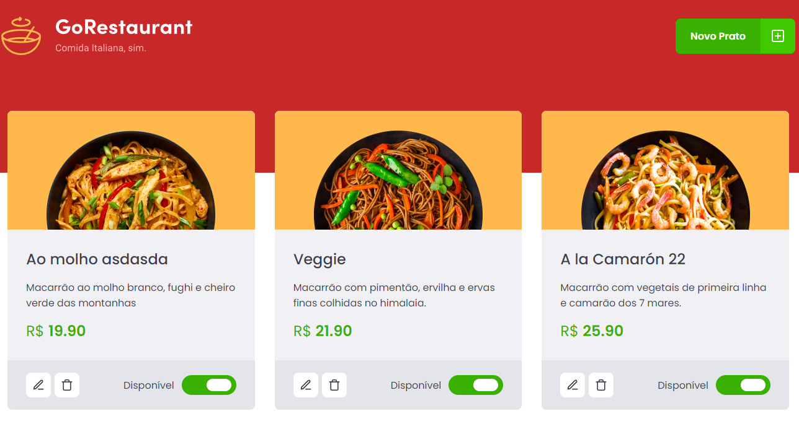

<h1 align="center">
  GoRestaurant
</h1>

  <a href="#-tecnologias">Tecnologias</a>&nbsp;&nbsp;&nbsp;|&nbsp;&nbsp;&nbsp;
  <a href="#-projeto">Projeto</a>&nbsp;&nbsp;&nbsp;|&nbsp;&nbsp;&nbsp;
  <a href="#-layout">Layout</a>&nbsp;&nbsp;&nbsp;|&nbsp;&nbsp;&nbsp;
  <a href="#memo-licença">Licença</a>

 

  

## 🚀 Tecnologias

Esse projeto foi desenvolvido com as seguintes tecnologias:

- Reactjs
- Typescript
- Styled Components

## 💻 Projeto

O projeto sistema de gestão de cardápio de restaurante. 

Este projeto é um desafio da trilha de Reactjs do curso Ignite da Rocketseat.

O objetivo era migrar o projeto que foi construído em React puro e com componentes em classe, para Typescript e componentes funcionais.

## :memo: Licença

Esse projeto está sob a licença MIT. Veja o arquivo [LICENSE](LICENSE.md) para mais detalhes.

---

